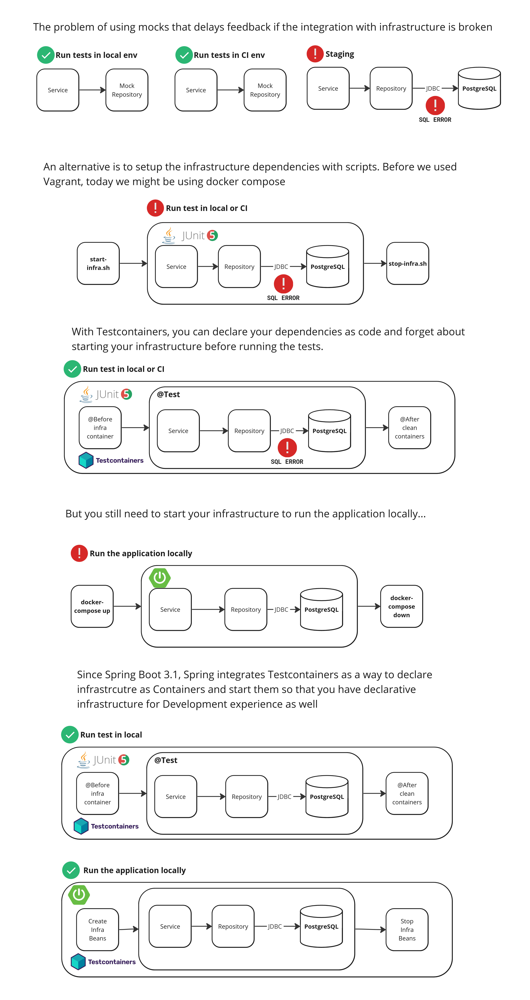

# testcontainers-scpna

Repository used during the workshop at [Pamplona Software Crafteters](https://pamplonaswcraft.com/).

- [`without-testcontainers`](./without-testcontainers/) aims to share the problems of usnig mocks and the need of starting the infrastructure before running the integration tests. Aims to share the old way of doing it.
- [`with-testcontainers`](./with-testcontainers/) aims to share how to declare dependencies for your tests as well as how to start your application using Container application dependencies for local development.
    - [`AbstractIntegrationTest`](./with-testcontainers/src/test/java/dev/aleixmorgadas/withtestcontainers/AbstractIntegrationTest.java): Shows how to declare a Postgres and a Kafka and they are used for all the tests instead of starting one instance per test class.
    - [`ProfileRepositoryTest`](./with-testcontainers/src/test/java/dev/aleixmorgadas/withtestcontainers/ProfileRepositoryTest.java) is an example of a Postgres integration test.
    - [`KafkaIntegrationTest`](./with-testcontainers/src/test/java/dev/aleixmorgadas/withtestcontainers/KafkaIntegrationTest.java) is an example of a Kafka integration test.
    - [`RunApplication`](./with-testcontainers/src/test/java/dev/aleixmorgadas/withtestcontainers/RunApplication.java) contains the necessary application dependencies to start those containers for local development.

## More information at

- https://testcontainers.com/
- https://testcontainers.com/cloud/
- https://github.com/testcontainers
- https://github.com/testcontainers/workshop in case you want to run a workshop at your company to learn Testcontainers together :smile: 

## Have fun testing! :smile:

